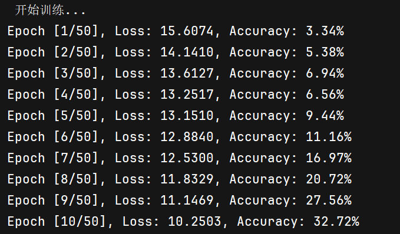
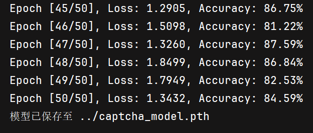
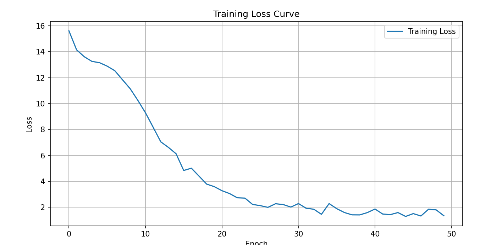
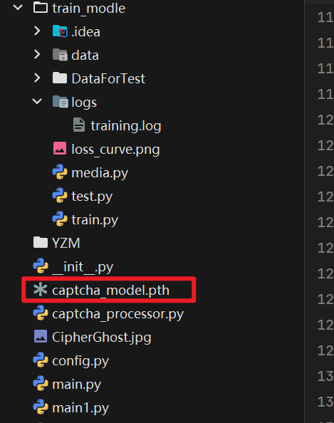
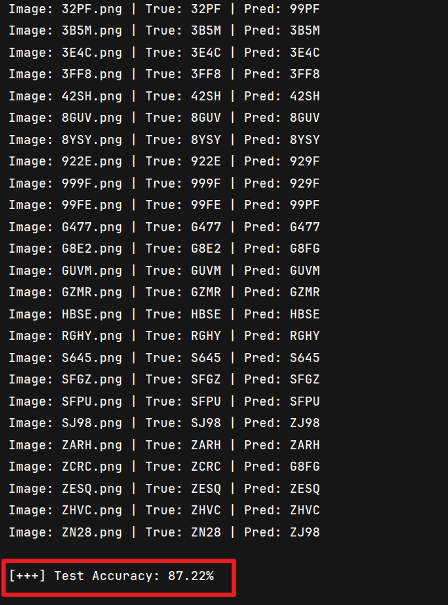
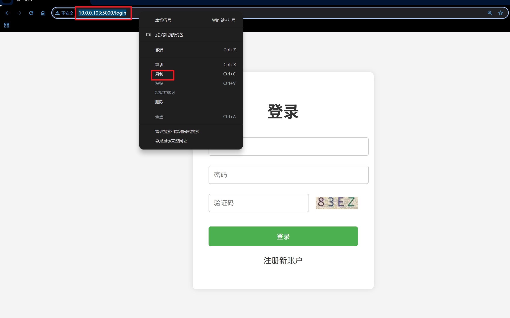
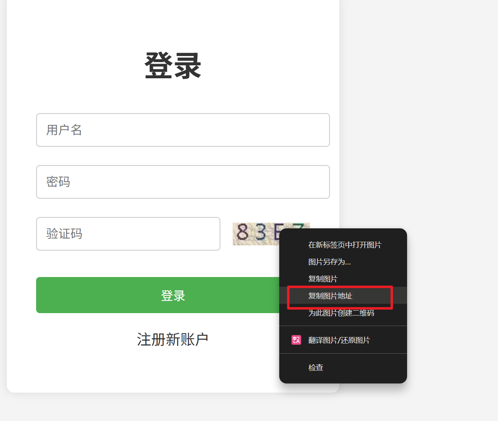
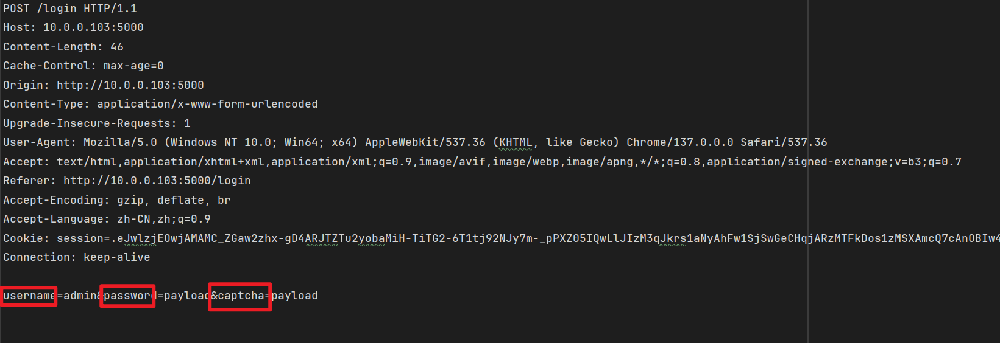
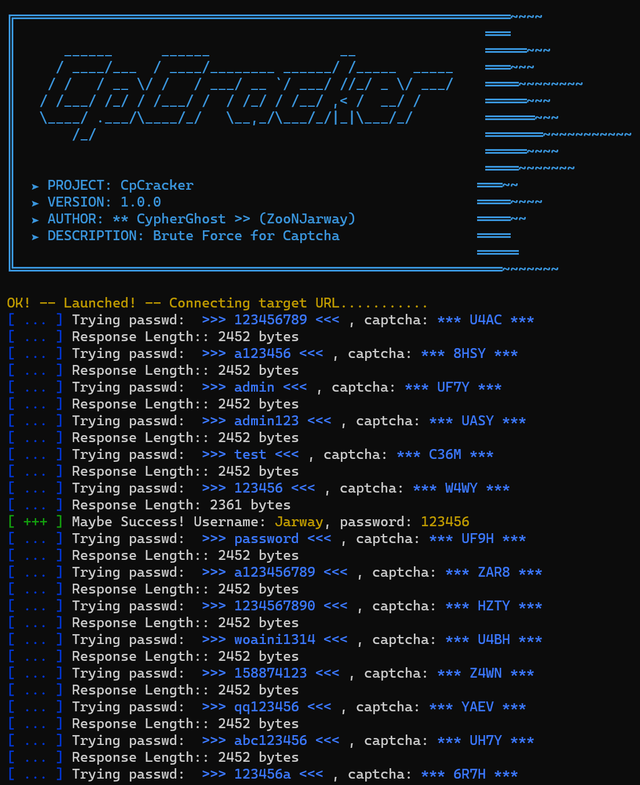
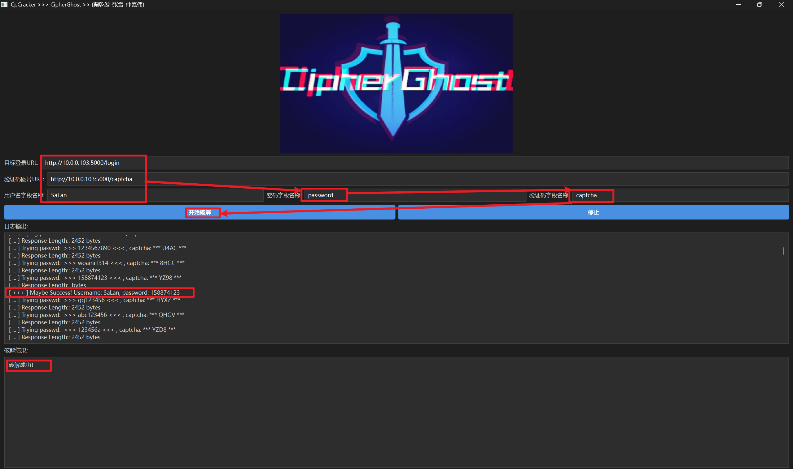

# CpCracker

## 简介
一套完整的验证码破解工具，实现从验证码获取、图像预处理、CNN模型识别到自动化爆破的全流程自动化。

## 核心功能
- **验证码识别**：CNN模型对62字符集（0-9a-zA-Z）验证码识别准确率
- **全自动化**：自动获取验证码、识别、提交爆破
- **会话管理**：自动处理Cookie和Session
- **结果验证**：智能判断爆破成功与否

##  技术栈
- Python + PyTorch（深度学习框架）
- OpenCV（图像预处理）
- CNN（2层卷积 + 2层全连接）
- Requests（网络请求）

# 使用说明

## 模型训练

运行`train.py`，开始训练模型

```bash
python train.py
```







训练好的模型`captcha_model.pth`保存在上一级目录



## 模型测试

运行`test.py`文件，测试模型

```bash
python test.py
```



## 调用模型暴力破解

### Shell版本

登录网站，复制目标URL，验证码URL





```text
http://10.0.0.103:5000/login
http://10.0.0.103:5000/captcha
```

根据POST请求包确定载荷（POST请求复制粘贴到POST.txt中）



终端运行`main.py`

```cmd
python main.py --target-url http://127.0.0.1:5000/login --captcha-url http://127.0.0.1:5000/captcha --user Jarway --pwd password --cap captcha
```

`--target-url:`**目标站点登录页面**

`--captcha-url:`**目标站点登录页面的验证码链接**

`--user:`**指定用户名**

`--pwd:`**设置密码载荷**

`--cap:`**设置验证码载荷**



### UI版本

直接运行`run_UI.bat`




